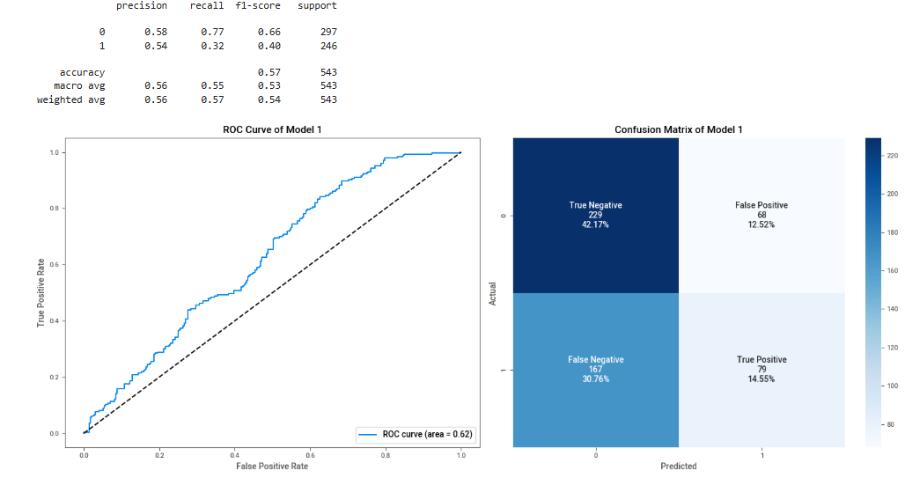

# Predicting UK General Election Results

## Executive Summary
In June 2025, YouGov projected over 300 seats could ‘swing’ at the next UK General Election, surpassing 2024 levels. This project explored an alternative approach to YouGov’s MRP, instead opting to use Logistic Regression. Data extracted from the House of Commons Library (HOCL), Office for National Statistics (ONS) and YouGov was used to produce a Logistic Regression model capable of predicting probabilities of each English constituency 'swinging' to a new party at the next election. Whilst the target was to achieve 85% Precision, the best model achieved 54%, predicting 415 ‘Hold’ and 128 ‘Swing’ seats (~172 below YouGov). Results were mapped geospatially, providing constituency-level visualisation accessible via this repository. This project was severely hampered by the class imbalance within the dataset and the magnitude of swing at the 2024 election. Future iterations of this project should focus on utilising a classification technique capabale of handling severe class imbalance.

## Data Engineering
Due to extraction limitations on the HOCL and ONS websites, each of the electoral and demographic datasets were extracted on an individual basis, resulting in the extraction of 17 standalone datasets. As such, PowerQuery was selected to complete the bulk of data engineering tasks within this project based on user competence. All datasets were cleaned, transformed and merged into a master dataset. The diagram below provides a high-level summary of the project's ETL pipeline:
<br>


## Exploratory Data Analysis
Once the master dataset was loaded into a Jupyter Notebook, the first step in the EDA process was to visualise historical election results. The plot below revealed geographical biases and party ‘strongholds’ within the dataset and highlighted the magnitude of ‘Swing’ at the 2024 GE. 
<br>
<br>
<br>
### Historical Election Results

<br>
<br>
<br>
### Train & Test Splitting
To prevent data leakage and overfitting, train and test sets were created from the master dataset and split temporally (train: 2010-2019; test: 2024). Splitting temporally allowed test predictions to be validated on ‘unseen’ 2024 data.
```python
# Training Dataset - 2010 - 2019
train_data = masterset[(masterset['election_year'] <= 2019)]

# Test Dataset - 2024
test_data = masterset[masterset['election_year'] == 2024 ]
```
### SweetViz EDA
Further EDA was conducted using the SweetViz API and allowed the project to analyse feature distrubiton, correlation and multicollinearity within the Training dataset. As shown in the output below, a severe 88% : 12% imbalance was found within the target 'swing' feature.
<br>
<br>
<br>

<br>
<br>
<br>
Correlation analysis revealed strong correlation between several features and suggested potential multicollinearity within the training set. 
<br>
<br>
<br>

<br>
<br>
<br>
## Data Preprocessing
After considering the potential effect of multicollinearity on model performance, the features listed below were excluded from the training and test datasets; irrelevant and redundant features were also dropped at this stage.
```python
train_data = train_data.drop(columns=['candidate', 'uk_turnout', 'party_colour',
                                      'winning_party', 'constituency', 'GlobalID', 
                                      'geometry', 'winning_vote_share'])

test_data = test_data.drop(columns=['candidate', 'uk_turnout', 'party_colour',
                                    'winning_party', 'constituency', 'GlobalID', 
                                    'geometry', 'winning_vote_share'])
```
<br>

In-line with Logistic Regression requirements, categorical features within the train and test sets were encoded to produce binary values for each.

```python
train_data = pd.get_dummies(train_data, columns=['prev_party', 'region'], drop_first=True)
test_data = pd.get_dummies(test_data, columns=['prev_party', 'region'], drop_first=True)
```
X and Y Train & Test sets were created and the target feature 'swing' assigned to the Y data:

```python
X_train = train_data.drop(columns=['swing','constituency_code','election_year'])
X_test = test_data.drop(columns=['swing','constituency_code','election_year'])

y_train = train_data['swing']
y_test = test_data['swing']
```
Considering the differing range of scales amongst demographic, economic and opinion data, the decision was taken to scale all numerical features to prevent features with large numerical values dominating the model. 

``` python
scaler = StandardScaler()
scale_columns = X_train.select_dtypes(include=['int64', 'float64']).columns
X_train[scale_columns] = scaler.fit_transform(X_train[scale_columns])
X_test[scale_columns] = scaler.fit_transform(X_test[scale_columns])

```

## Model Creation & Evaluation
### Baseline Model
A baseline model was created using the 'balanced' class_weights feature to mitigate the class imbalance seen within the dataset and was used to make swing predictions and probabilities.
``` python
model_1 = LogisticRegression(max_iter=1000, class_weight='balanced', random_state=42)
model_1.fit(X_train, y_train)
y_pred_1 = model_1.predict(X_test)
y_prob_1 = model_1.predict_proba(X_test)[:,1]
```
Baseline model results were obtained using a classification report and indicated poor model performance, with Swing Precision scoring 0.54 and Recall of 0.32; an ROC curve further confirmed the poor performance.
<br>
<br>
<br>

<br>
<br>
<br>
### SMOTE Iteration
Considering the poor model performance, a second iteration utilised the SMOTE oversampling technique in an attempt to overcome the impact class imbalance was having upon the model. 
<br>

```python
smote = SMOTE()
X_train_smote, y_train_smote = smote.fit_resample(X_train, y_train)
y_pred_2 = model_2.predict(X_test)
y_prob_2 = model_2.predict_proba(X_test)[:,1]
```
<br>


<br>

### Feature Engineered Iteration
The results obtained from the SMOTE iteration indicated its model performance was below that of the baseline model and indicated feature selection could be influencing the model. 

As such, feature importance analysis was conducted by extracting feature coefficients and exponentiating to obtain the odds Odds. To enhance the importance analysis, Recursive Feature Elimation using Stratified K-fold (RFECV) was used alongside interpretting Log-Odds.

```python
# Extract Coefficients and Exponents
model_1_coeff = model_1.coef_[0].round(2)
model_1_exp = np.exp(model_1_coeff).round(2)

# RFECV
strat_kfold = StratifiedKFold(n_splits=5, shuffle=True)
rfecv = RFECV(estimator=model_1, step=1, cv= strat_kfold, scoring='roc_auc')
rfecv.fit(X_train, y_train)
```
<br>
Analysis of feature importance indicated some redundant or irrelevant features. These features were eliminated and a third iteration trained and evaluated:

```python
feature_drop = ['population_above_50', 'male', 'unemployed', 'tenure', 
                'prev_party_GREEN', 'prev_party_KHHC', 'prev_party_RES', 'prev_party_UKIP' ,
                'region_London' ,'region_South West']

X_train_3 = X_train.drop(columns=feature_drop)
X_test_3 = X_test.drop(columns=feature_drop)

model_3 = LogisticRegression(max_iter=1000, class_weight = 'balanced', random_state=42)
model_3.fit(X_train_3, y_train)
```


As seen in the confusion matrix and ROC curve, no further improvement was made to model performance. As such, a final iteration using GridSearchCV was created; however, model evaluation revealed no significant improvement to model performance.

```python
# Set the grid parameters:
grid_parameters = {
    'C': [0.01, 0.1, 1, 10, 100],
    'penalty': ['l1', 'l2'],
    'solver': ['liblinear']}

# Create the Gridsearch
grid_search = GridSearchCV(
    estimator= model_1,
    param_grid= grid_parameters,
    scoring='roc_auc',
    cv= strat_kfold,
    n_jobs= -1,
    verbose= 1)

# Train the model
grid_search.fit(X_train, y_train)
```


## Model Selection
Despite the attempts to improve performance, the baseline model produced the most favourable results amongst model iterations. With the project objective in mind, the decision made to retrain the baseline model using the full master dataset and predict the probabilities of each English constituency swinging at the next General Election.

## Model Predictions
Swing predictions and probabilites were visualised using a Choropleth Map in Plotly Express to create an interactive 'Swing Predictions Map'. 
This map can be viewed using this link:

[View Interactive Map]( https://wkandrews.github.io/Predicting-UK-Election-Results/visualisation_files/swing_map.html)

## Conclusion & Next Steps
Model performance throughout this project demonstrated the class imbalance within the target feature significantly impacted Logistic Regressions ability to predict seat swing at the next GE. Whilst model performance was poor, this project achieved its primary objective and has created a framework for future project iterations to utilise. Its suggested future iterations should focus on using more appropriate classification techniques to handle the class imbalance and capable of integrating swing magnitude seen in the 2024 GE. 

## References & Data Sources
Please refer to 'Reference List.pdf' within this repository.
